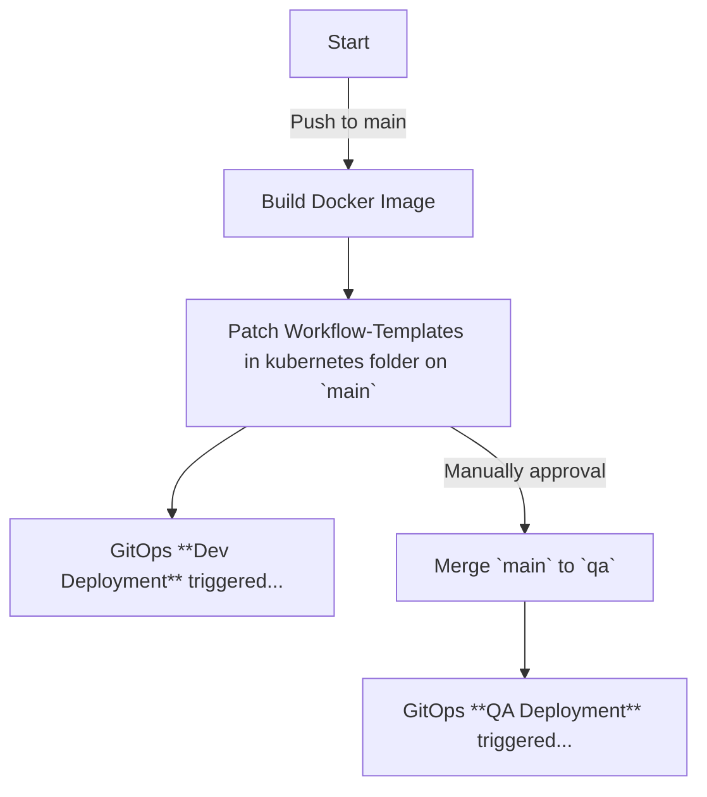

# Hera Blueprint 

Blueprint for a Hera project incl. gitops support. 
You can [use this repo as template](https://github.com/aiknow-public/hera-blueprint/generate) for your hera project.

## How to use the template repository 
1) Create a repo referencing this repo here as a template.
1) Protect the QA environment (Settings menu, Environments --> add a reviewer).
1) Create a qa branch from main.
1) Fix your README.md: Adjust the repo in the banner above and delete the chapter "How to use the template repository ".

## Development

### TL;DR
1) Create a repository using this repo here as a template
1) Open it in GitHub Codespaces
1) Create a branch, do some change in the python code an create a PR
1) Copy the environmental variables from the argo server (--> User menu, Button "COPY TO CLIPBOARD")
1) Paste them into the terminal in your codespace
1) Run `./run_workflow.sh -f example_workflow.py`  
--> An ephemeral docker image will be created and a workflow will be started using it. The output of the workflow with be written to the terminal.

### Prerequisites
- To be able to push a docker image with the [run_workflow.sh](./run_workflow.sh) script, access to
this repository's github container registry is required ("package write").
To allow this, set the environmental variables `DOCKER_REGISTRY`,`DOCKER_ORGANIZATION`, `DOCKER_USER` and `DOCKER_PASSWORD` (ideally via Codespaces secret)
- As well, the k8s cluster(s) should have read access to used the container registry.

## Folder structure
- [kubernetes](kubernetes)  
Contains the rendered workflow files, deployed via gitops.

- [src/main](src/main)  
Contains the package(s) with the actual code (business logic) and the third-party requirements.  
There is a pipeline which automatically builds a docker image out of it.

- [src/workflows](src/workflows)  
Contains the workflow code (DAGs or Steps).  
The actual workflows / workflow templates are created
by [run _workflow.py](src/run_workflow.py) and [render_workflows.py](src/render_workflows.py).

## Scripts
- [render_workflows.py](./src/render_workflows.py)  
Used to render the WorkflowTemplate(s) as yaml, in order to deploy them via gitops.  
(Triggered by github workflow) 

- [run_workflow.sh](./run_workflow.sh)  
Script to run a workflow for debugging, it can be started locally or via codespaces. 
Make sure to set the required environment variables, e.g. via a `.env` file. Use --help for more info.

## Deployment

### Prerequisites
For the gitops deployment, the gitops server (flux / argo) needs to poll this repository for
changes in the [kubernetes](kubernetes) folder and on related branches (`main` branch for deployment to Dev and `qa` branch for deployment to QA).

### Pipeline / Workflow

#### Dev Deployment
The [build pipeline](https://github.com/aiknow-public/hera-blueprint/actions/workflows/build-main-image-and-deploy.yaml) automatically
builds a docker image and patches the yaml files in [kubernetes](kubernetes). Accordingly, via GitOps, the WorkflowTemplates are deployed to the Dev environment.

#### QA Deployment
The [build pipeline](https://github.com/aiknow-public/hera-blueprint/actions/workflows/build-main-image-and-deploy.yaml)' last step automatically
merges the changes on main to qa branch.
Accordingly, via GitOps, the WorkflowTemplates are deployed to the QA environment.
